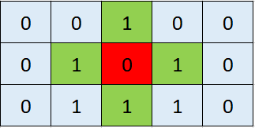
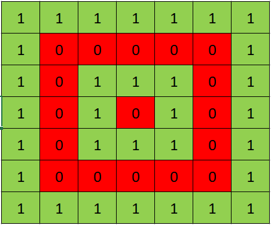

# 1. Chú ý

- Sau khi làm xong bài test, vui lòng gửi source code của bạn tới email contact@mindx.edu.vn với tiêu đề:`[Tên của bạn] [Test đầu vào CI] [SĐT]`.

- Khi nộp bài test, ứng viên cần gửi file code `(.html, .css, .js)` thay vì gửi file qua `Word` hay `Google Docs`.

- Ứng viên được khuyến khích commit bài của mình lên Github (nếu đã biết về Git và Github) hoặc `nén lại bài test trước khi gửi, tránh trường hợp gửi file pdf hay txt`.

# 2. Kiến thức

- Ứng viên có kiến thức về lập trình Web với `HTML5, CSS3, Javascript`...

- Ứng viên có nền tảng về `Web design`, hiểu được `Box Model`, `CSS Selectors`, `Flexbox`, `Responsive Design`.

- Kiến thức về Javascript như `variables, data types, array, object, function, scope, operators,`...

- Đã thao tác về DOM với HTML5, CSS3

- Nắm bắt được các cách thao tác Networking như là: `GET, POST, PUT, DELETE API`.

# 3. Thử thách

## A. Problem Solving

Trang trại của Van có rất nhiều vườn. Mỗi khu vườn đều được **_bao quanh hoàn toàn bằng các khung gỗ (bên trái, bên phải, trên, dưới)_** . Để thuê nhân công thu hoạch khi tới mùa thì Van cần biết số lượng khu vườn trong trang trại của mình. Cho một mảng số nguyên **_arr_** trong đó:

- Số 0: là phần đất của khu vườn.
- Số 1: là các khung gỗ của khu vườn.

Nhiệm vụ của bạn là hãy trả về số lượng khu vườn trong trang trại.

```js
function numGardens(arr) {
  // do something
  return result;
}
```

### Ví dụ:

```js
// Với arr = [[0,0,1,0,0],[0,1,0,1,0],[0,1,1,1,0]]

let arr = [
  [0, 0, 1, 0, 0],
  [0, 1, 0, 1, 0],
  [0, 1, 1, 1, 0],
];

numGardens(arr); // return 1
```

Giải thích: Nhìn vào hình bên dưới. **_Phần màu xanh lá phần khung gỗ. Màu đỏ là khu vườn_**.



```js
// Với arr = [[1,1,1,1,1,1,1],[1,0,0,0,0,0,1],[1,0,1,1,1,0,1],[1,0,1,0,1,0,1],[1,0,1,1,1,0,1],[1,0,0,0,0,0,1],[1,1,1,1,1,1,1]];

let arr = [
  [1, 1, 1, 1, 1, 1, 1],
  [1, 0, 0, 0, 0, 0, 1],
  [1, 0, 1, 1, 1, 0, 1],
  [1, 0, 1, 0, 1, 0, 1],
  [1, 0, 1, 1, 1, 0, 1],
  [1, 0, 0, 0, 0, 0, 1],
  [1, 1, 1, 1, 1, 1, 1],
];

numGardens(arr); // return 2
```

Giải thích: Nhìn vào hình bên dưới



### Chú ý:

- [Đầu vào] Matrix of Integer
  `1 ≤ arr.length ≤ 100`.
- [Đầu ra] Integer
  Số khu vườn thỏa yêu cầu đề bài.

## B. Code Challenge

Xây dựng trang web "Random Meal Generator" với các chức năng như trang web [Random Meal Generator](https://random-meal-generator-app.netlify.app/)
[](https://app.netlify.com/sites/random-meal-generator-app/deploys)

### Chú ý:

- Bổ sung phần banner vs footer cho trang web ( tuỳ chọn )

- Trang web có tính Responsive cho các loại màn hình.

- Sử dụng được các framework CSS như Bootstrap, JavaScript library như Jquery,... càng tốt.

- Tối thiểu phải làm được layout giống như bài mẫu. Làm đẹp hơn là điểm +
- API: [https://www.themealdb.com/api/json/v1/1/random.php](https://www.themealdb.com/api/json/v1/1/random.php)
